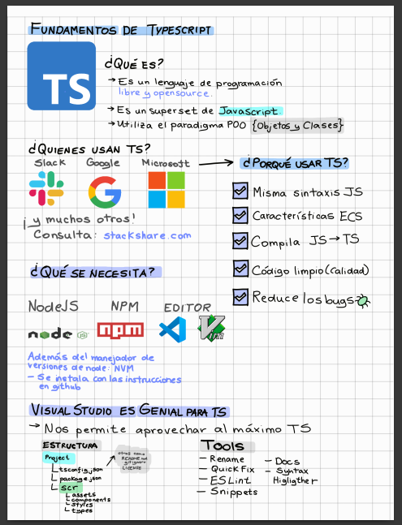
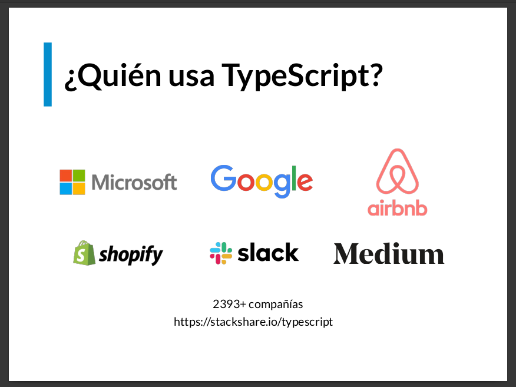

# PLJS02-Typescript-Fundamentals

Video playback platform. Legacy Media Player offers a collection of plugins that extend the functionality of the video player.

<p align=center></p>

***

# 💻 Typescript fundamentals

<p align="left">
  
</p>

## Description

<p align=justify>
  In this repository you will find the <b>exercises and notes</b> from the <b>typescript fundamentals course</b>. In addition, it contains a small project for managing a photos app, which has classes such as users, photos, and albums where the concepts of OOP are applied.
</p>

<p>The objectives of this course are:</p>
<table style="border:1px solid black;margin-left:auto;margin-right:auto;">
  <tr>
    <td>
      <p align=center></p>
    </td>
    <td>
      <p>Use the primitive types of Typescript to have a better code.</p>
    </td>
  </tr>
  
  <tr>
    <td>
      <p align=center></p>
    </td>
    <td>
      <p>Create custom types for project workflow.</p>
    </td>
  </tr>

  <tr>
    <td>
      <p align=center></p>
    </td>
    <td>
      <p>Know the advantages of adding types to Javascript.</p>
    </td>
  </tr>

  <tr>
    <td>
      <p align=center></p>
    </td>
    <td>
      <p>Configure Typescript tools.</p>
    </td>
  </tr>
  
</table>


***

## Project: Photo-App 📸

<p align=center>
  
</p>

In the course we carried out a small project to simulate the code that a photography app like flickr would have. We work with classes such as User 🧑🏽‍💻, Picture 🌇 and Album 🗃, we relate the classes, we apply **Inheritance, Interfaces and Abstract classes**.
You can see the photo-app code [here](https://github.com/estalvgs1999/PLJS02-Typescript-Fundamentals/tree/master/picture-place-core/src/photo-app)!

***

## Prerequisites 📋

_To work with typescript you will need the following tools_

* Node JS
* nvm
* NPM
* typescript
* webpack

## Deployment 📤
To run a script:
```PowerShell
# Compile file
> tsc file.ts

# Run result
> node dist/file.js
```

To run the npm project:
```PowerShell
# Dev mode
> npm install
> npm run build
```

**You can see more options in the course notes!**

## Built With

For the development of this project we use the following technologies

<table style="border:1px solid black;margin-left:auto;margin-right:auto;">
  <tr>
    <td>
      <p align=center></p>
    </td>
    <td>
      <p align=center></p>
    </td>
    <td>
      <p align=center></p>
    </td>
    <td>
      <p align=center></p>
    </td>
    
  </tr>
  
  <tr>
    <td>
      <p align=center><a href="https://www.angular.io"><b>NPM</b></a>
        </br>Package Manager</p>
    </td>
    <td>
      <p align=center><a href="https://dotnet.microsoft.com/apps/aspnet"><b>Node JS</b></a>
</br>JS Runner</p>
    </td>
    <td>
      <p align=center> <a href="https://www.microsoft.com/es-es/sql-server/sql-server-downloads"><b>Typescript</b></a>
        </br>The core of everything</p>
    </td>
    <td>
      <p align=center>
        <a href="https://developer.android.com/studio"><b>Webpack</b></a>
</br>Modules</p>
    </td>
    
  </tr>
</table>

## Docs 📖

You can find the <b>notes and the slides</b> of the course in our [documentation section](https://github.com/estalvgs1999/PLJS02-Typescript-Fundamentals/tree/master/picture-place-core/doc)

<p align=center>
  
  
</p>

## Authors

I have developed this project on my way to becoming an Angular professional.
* **Esteban Alvarado** - *Software Developer* - [@estalvgs1999](https://github.com/estalvgs1999)

The thanks for this project go to [platzi](https://platzi.com/clases/javascript-profesional/)!

## License 📄

This project is licensed under the GNU License - see the [LICENSE.md](https://github.com/estalvgs1999/PLJS02-Typescript-Fundamentals/blob/master/LICENSE) file for details

***
<p align="center">

</p>
